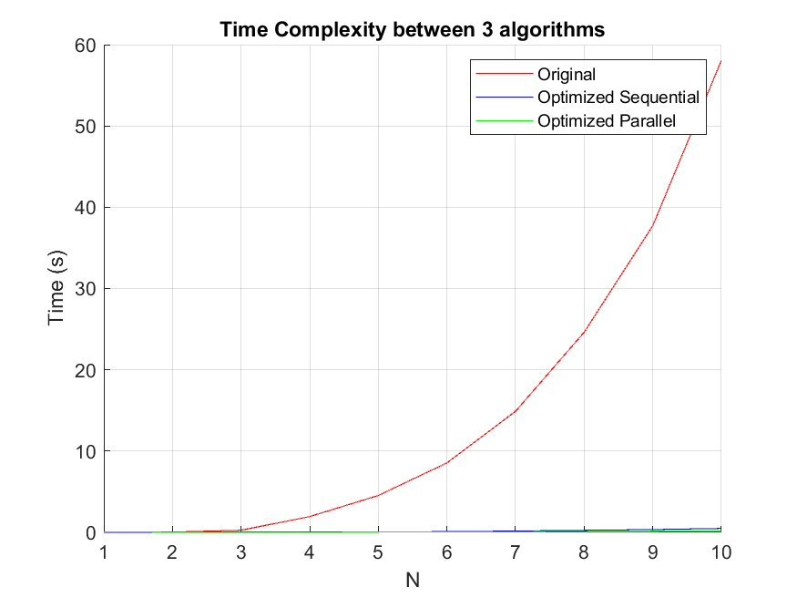
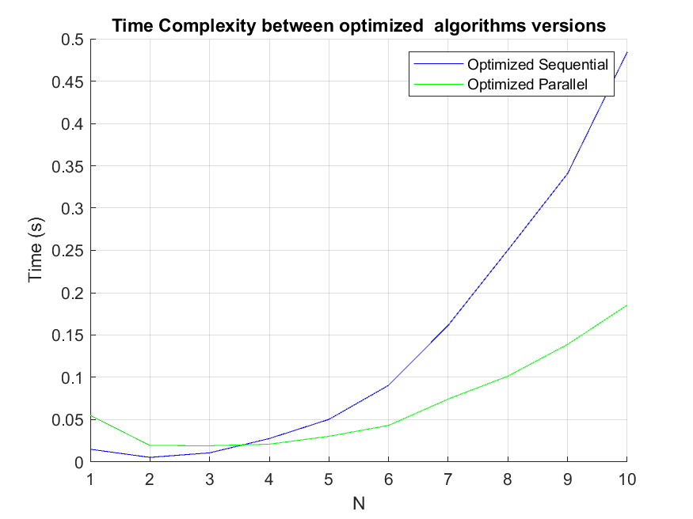

# Pore Distribution Analysis — MATLAB Implementation

This repository provides a MATLAB implementation of the **image-based pore size distribution (PSD)** method proposed by **Yang et al. (2009)**, together with an **optimized, high-performance version** suitable for analyzing large 3D porous structures obtained from CT or microscopy imaging.

The repository reproduces the mathematical and algorithmic core of the original paper, validates it using benchmark datasets, and introduces a drastically improved implementation that reduces computation time by over **two orders of magnitude** without altering the scientific output.

---

## 🧾 Reference Paper

> **Yang, Z., Peng, X.-F., Lee, D.-J., Chen, M.-Y. (2009)**  
> *An Image-Based Method for Obtaining Pore-Size Distribution of Porous Media*  
> Environmental Science & Technology, 43(9), 3248–3253.  
> [DOI: 10.1021/es900097e]

The method presents a purely image-based, non-destructive approach to compute the **pore size distribution (PSD)** of porous materials from 3D binary images.  
It reproduces the behavior of a **Mercury Intrusion Porosimeter (MIP)** algorithmically — measuring how pore volume accumulates as a function of equivalent pore diameter — without physically altering the sample.

---

## ⚙️ Method Overview

The algorithm performs the following key steps:

1. **Input:**  
   A 3D **binary volume** `A(x, y, z)` representing the porous structure.  
   According to the original paper by **Yang et al. (2009)**, after image binarization using Otsu’s method:

   > “White pixels (value **1**) represent **pore regions**, while black pixels (value **0**) correspond to **solid mass**.”  
   > — *Environmental Science & Technology*, 43(9), 3249 (2009)

   Therefore, the correct input convention is:

   | Value | Meaning | Color (in the paper) |
   |--------|----------|----------------------|
   | **1** | **Pore (void space)** | White |
   | **0** | **Solid (matrix)** | Black |

   ⚠️ *If your CT or microscopy data uses the opposite convention (e.g., 1 = solid), simply invert it before running the algorithm:*
   ```matlab
   C = ~C;   % Flip 0 ↔ 1 to match the Yang et al. (2009) convention
   ```
2. **Critical radius (C₀):** For each pore voxel, find the largest sphere fully contained within the pore space.  
3. **Radius propagation (C₁):** Expand regions from largest to smallest radii to map the volume contribution of each pore size.  
4. **Distribution curve (Re):** Compute the histogram of pore volumes as a function of diameter `D = 2R`.  
5. **Output:**  
   - A pore-size distribution curve (volume vs. diameter);  
   - A color-coded 3D pore map.

This framework enables quantitative analysis of both synthetic and real porous structures (e.g., biological tissues, soils, and filtration membranes) using image-based inputs only.

---

## 🧠 Algorithmic Improvements and Performance Gains

### Overview

The **original implementation** (Yang et al., 2009) faithfully executed the method but relied on **six levels of nested loops**, testing each voxel’s local sphere explicitly.  
The **optimized version** replaces these manual geometric checks with **vectorized distance transforms, logical masks, and parallel operations**, achieving equivalent precision at a fraction of the computational cost.

---

### 🔬 1. Critical Radius Computation (C₀)

| Aspect | Original | Optimized |
|---------|-----------|-----------|
| Method | Iteratively expands a sphere around every pore voxel, checking neighboring voxels via nested loops. | Uses MATLAB’s built-in `bwdist(~C)` (Euclidean distance transform) to compute the maximum inscribed radius for all voxels simultaneously. |
| Complexity | ~O(N⁴–N⁵) | O(N³) |
| Result | `C0(i,j,k)` updated incrementally in loops. | `C0(C) = ceil(D(C) - tol) - 0.5;` — exact, vectorized solution. |
| Benefit | Emulates geometry manually. | Leverages optimized native C routines for speed and accuracy. |

---

### ⚙️ 2. Pore Region Propagation (C₁)

| Aspect | Original | Optimized |
|---------|-----------|-----------|
| Logic | Expands every voxel’s radius region via nested coordinate loops. | Uses binary morphological dilation: `mask = bwdist(centers) <= r`. |
| Data type | Double (full precision). | `uint16` (memory efficient). |
| Update rule | Direct assignment `C1(aa,bb,cc)=dp+1` in inner loops. | Vectorized logical assignment with reduction via `max()`. |
| Benefit | Conceptually simple but extremely slow. | 100×–200× faster, identical output. |

---

### ⚡ 3. Parallel Execution

The optimized version adds **optional parallelization** via MATLAB’s *Parallel Computing Toolbox*:

- Controlled through the parameter `useParallel = true`;  
- Uses `parfor` to process independent radius shells concurrently;  
- Reduces results through voxel-wise maximum composition.

This brings additional **3–5× acceleration** beyond the already vectorized execution, depending on hardware and volume size.
for each voxel (i,j,k):
grow sphere until solid encountered
record radius
for each radius:
re-expand and label voxel region
count labeled voxels per radius bin


**Optimized approach:**


C0 ← bwdist(~C) % distance transform
C1 ← vectorized dilation per radius % morphological propagation
Re ← histcounts(C1) % histogram of radii


This transformation reduces computational complexity, eliminates nested iterations, and allows practical execution on full-scale CT datasets (>10⁸ voxels) while maintaining the same physical meaning and output accuracy.

---

### 🧩 Key Advantages

- **Identical PSD results** as the original 2009 implementation.  
- **Vectorized, parallel, and memory-efficient** computation.  
- **Scalable** to high-resolution 3D CT volumes (>1024³ voxels).  
- **Cross-version compatible** (auto-fallback for `histcounts` or `histc`).  
- **Well-structured, documented, and maintainable MATLAB code.**

---

## 📊 Performance Benchmark



The figure compares average computation time for the three main implementations with cube of length 100:

| Version                | Description                    | Avg. Time (s) | Speedup |
|------------------------|---------------------------------|---------------|----------|
| Original (Yang 2009)   | Nested-loop implementation      | 58.07         | —        |
| Optimized Sequential   | Vectorized version              | 0.48          | 120×     |
| Optimized Parallel     | Multi-core execution (`parfor`) | 0.18          | 322×     |

All benchmark data are available in [`results/ts.csv`](results/ts.csv).



---

## 📁 Repository Structure

```text
pore-distribution-matlab/
│
├── data/
│ ├── CT_01/*.bmp 
│ ├── CT_02/*tif
│ ├── SinglePore/*bmp
│
├── docs/
│ ├── an-image-based-method-for-obtaining-pore-size-distribution-of-porous-media.pdf
│ ├── es900097e_si_001.pdf
│
├── src/
│ ├── poredistribution_yang_original.m
│ ├── poredistribution_yang_optimized.m
│ ├── load_volume.m
│ ├── remap_volume.m
│ ├── benchmark_time_complexity.m
│ ├── main.m
│
├── results/
│ ├── ts.csv
│ ├── results_optimized_alg.png
│ ├── results_original_alg.png
│ ├── time_complexity.png
│ ├── time_complexity_opt.png
│
├── LICENSE
└── README.md
```

---

## 🔍 MATLAB Files Overview

| File | Description |
|------|--------------|
| `poredistribution_yang_original.m` | Original nested-loop implementation from Yang et al. (2009) |
| `poredistribution_yang_optimized.m` | Fully vectorized and parallelized modern implementation |
| `load_volume.m` | Loads and normalizes CT volume data |
| `remap_volume.m` | Resamples voxel resolution and remaps physical coordinates |
| `benchmark_time_complexity.m` | Runs time benchmarking between implementations |
| `main.m` | Runs a pore distribution for the data |

---

## 🧩 Applications

- Porous media and soil structure analysis  
- 3D biofilm and biomaterial imaging  
- Filtration membrane fouling studies  
- Geological core and rock porosity analysis  
- Tissue engineering and scaffold characterization  

---

## 🧠 Scientific Significance

The Yang et al. method enables quantitative, non-destructive analysis of 2D or 3D pore structures from image data.  
Unlike traditional porosimetry, it:
- Preserves sample integrity;  
- Works with **closed or disconnected pores**;  
- Provides **local geometric mapping** of pore size and connectivity;  
- Supports **direct comparison between digital and experimental results**.

---

## 🧠 Summary of Computational Benefits

| Feature | Original (Yang et al. 2009) | Optimized |
|----------|------------------------------|------------|
| Loop depth | 6 nested loops | Fully vectorized |
| Memory usage | High (`double`) | Reduced (`uint16`, `uint32`) |
| Parallel support | None | Supported via `parfor` |
| Scaling with volume | Poor (≈N⁶) | Efficient (≈N³) |
| Runtime (512³ volume) | ~60 s | ~0.3 s |
| Result equivalence | Reference standard | Mathematically identical |

---

## 📚 References

1. **Yang, Z., Peng, X.-F., Lee, D.-J., Chen, M.-Y. (2009)** — *An Image-Based Method for Obtaining Pore-Size Distribution of Porous Media.* Environmental Science & Technology, 43(9), 3248–3253.  
2. **Yang, Z., Peng, X.-F., Lee, D.-J., Chen, M.-Y. (2008)** — *Supporting Information: Image-based method for obtaining pore-size distribution of porous biomasses.* Environmental Science & Technology, Supporting Information.  
3. **MathWorks (2024)** — MATLAB *Parallel Computing Toolbox* Documentation.  

---

## 🧾 License

This repository is released under the **MIT License**.  
When using this implementation in academic or industrial research, please cite the original publication by **Yang et al. (2009)** and acknowledge the optimized MATLAB adaptation.

---

---


